<div align="center">

# Cardiac Risk Model Explorer

### Disease risk prediction from structured medical data

**A complete machine-learning system — not a notebook.**
Four algorithm families trained on the UCI Heart Disease dataset, compared under one honest
evaluation, exported, served behind a validated API, and driven by an accessible web interface
where every number on screen comes from the training run.

<br>

[](https://www.python.org/)
[](https://scikit-learn.org/)
[](https://xgboost.readthedocs.io/)
[](https://shap.readthedocs.io/)
[](https://fastapi.tiangolo.com/)

[](#-testing)
[](#-results)
[](#-results)
[](#-the-interface)
[](#-medical-disclaimer)

<br>

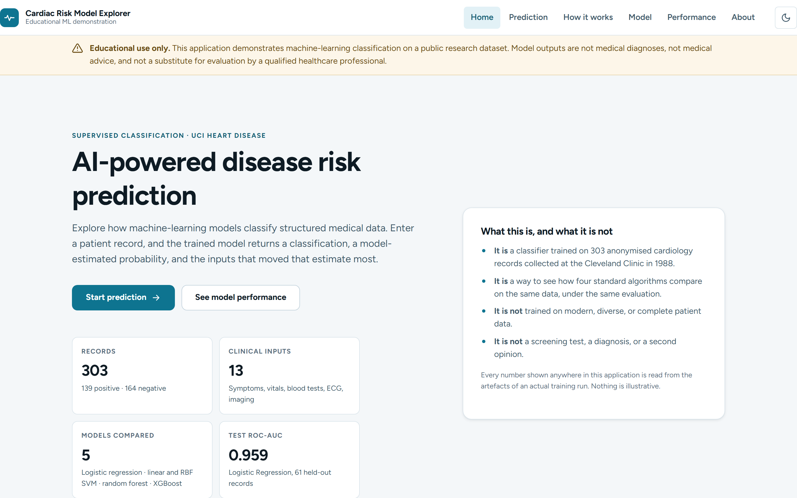

</div>

---

> [!WARNING]
> **Educational use only.** This project demonstrates machine-learning classification on a
> public research dataset. Model outputs are **not medical diagnoses, not medical advice, and
> not a substitute for evaluation by a qualified healthcare professional.** Do not use it to
> make, delay, or avoid any health decision.

---

## At a glance

<table>
<tr>
<td width="50%" valign="top">

**What it does**

Takes 13 clinical inputs — symptoms, age, blood tests, ECG and imaging results — and returns a
classification, a model-estimated probability, and the inputs that moved that estimate most.

</td>
<td width="50%" valign="top">

**What makes it more than a demo**

Leakage control proven by tests · a selection rule fixed before the results · a threshold chosen
for the cost of a missed case · calibration checked · three explainability methods · every
displayed number loaded from the training artefacts.

</td>
</tr>
</table>

| | | | |
|:--|:--|:--|:--|
| **303** records | **13** clinical features → 22 encoded | **5** models compared | **84** tests passing |
| **0.959** test ROC-AUC | **0.942** test PR-AUC | **96.4%** sensitivity | **~35 ms** warm inference |

<sub>Held-out test metrics on 61 records the model never saw, at the deployed 0.38 threshold.</sub>

---

## Contents

<table>
<tr><td valign="top">

1. [The interface](#-the-interface)
2. [Dataset, and why this one](#-dataset-and-why-this-one)
3. [Pipeline](#-pipeline)
4. [Algorithms and tuning](#-algorithms-and-tuning)

</td><td valign="top">

5. [Results](#-results)
6. [Choosing the final model](#-choosing-the-final-model)
7. [Threshold and calibration](#-threshold-and-calibration)
8. [Explainability](#-explainability)

</td><td valign="top">

9. [Error analysis](#-error-analysis)
10. [Architecture](#-architecture)
11. [Install and run](#-install-and-run)
12. [API](#-api)

</td><td valign="top">

13. [Testing](#-testing)
14. [Limitations](#-limitations)
15. [Medical disclaimer](#-medical-disclaimer)
16. [Future work](#-future-work)

</td></tr>
</table>

---

## 🖥 The interface

> [!NOTE]
> Every screenshot below was captured from the running application by
> [`scripts/capture_ui.py`](scripts/capture_ui.py), which starts the server, drives a real
> browser, and photographs the result. Nothing here is a mock-up, and every probability shown was
> produced by the exported model.

### Prediction

<table>
<tr>
<td width="50%" valign="top" align="center">
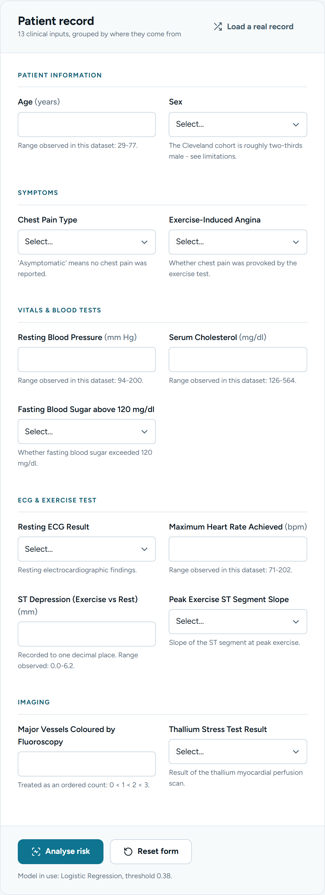<br>
<sub><b>The form is generated from <code>GET /api/schema</code></b> — the same schema the model was trained on, so the interface cannot drift from the model. Human labels, units and help text throughout; never a raw column code like <code>cp</code>.</sub>
</td>
<td width="50%" valign="top" align="center">
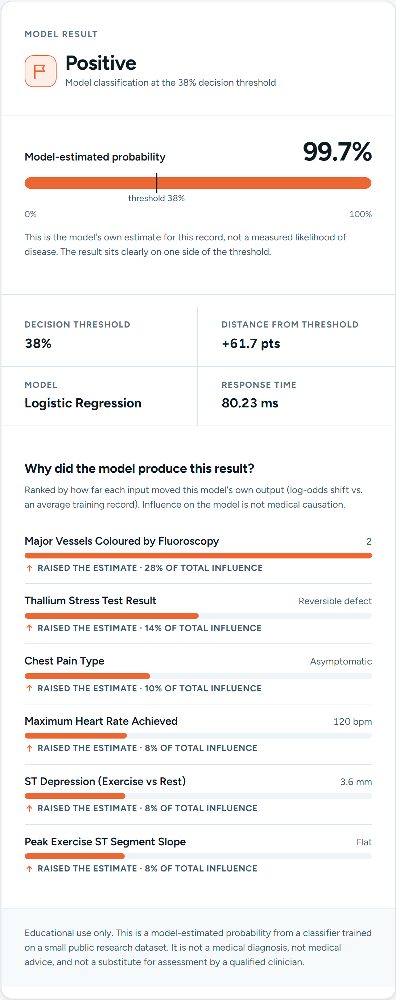<br>
<sub><b>A live result.</b> Classification, model-estimated probability, the threshold marked <i>in place</i> on the meter, distance from it, response time, and the six inputs that moved the estimate most — each with a direction and its share of total influence.</sub>
</td>
</tr>
</table>

<table>
<tr>
<td width="33%" valign="top" align="center">
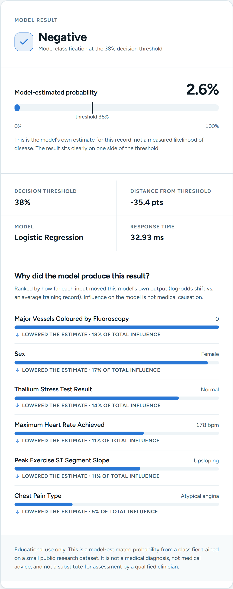<br>
<sub><b>The other side of the threshold.</b> No red-for-sick, green-for-healthy — a classification is not a verdict.</sub>
</td>
<td width="33%" valign="top" align="center">
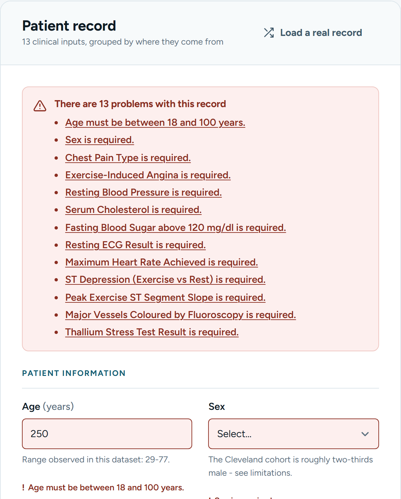<br>
<sub><b>Validation.</b> A focusable <code>role="alert"</code> summary links to each invalid field, and every field also carries its own inline message.</sub>
</td>
<td width="33%" valign="top" align="center">
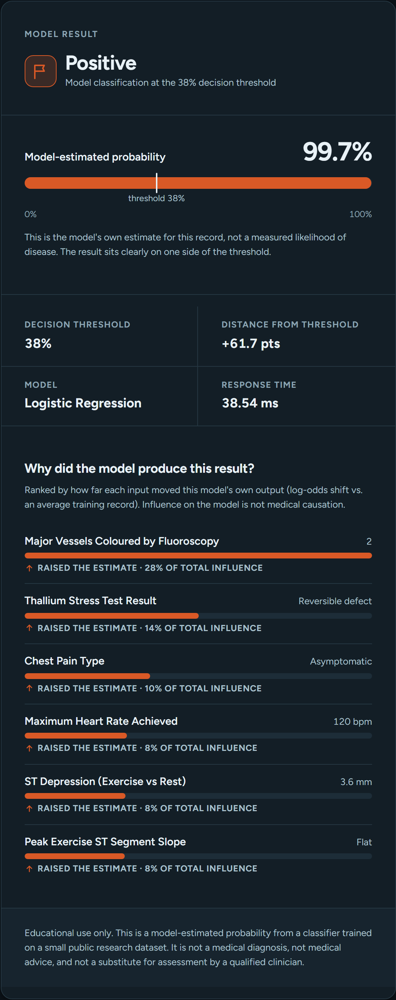<br>
<sub><b>Dark mode.</b> Charts and meters re-render with the theme's own validated colour steps, not an automatic flip.</sub>
</td>
</tr>
</table>

### Explaining itself

<div align="center">
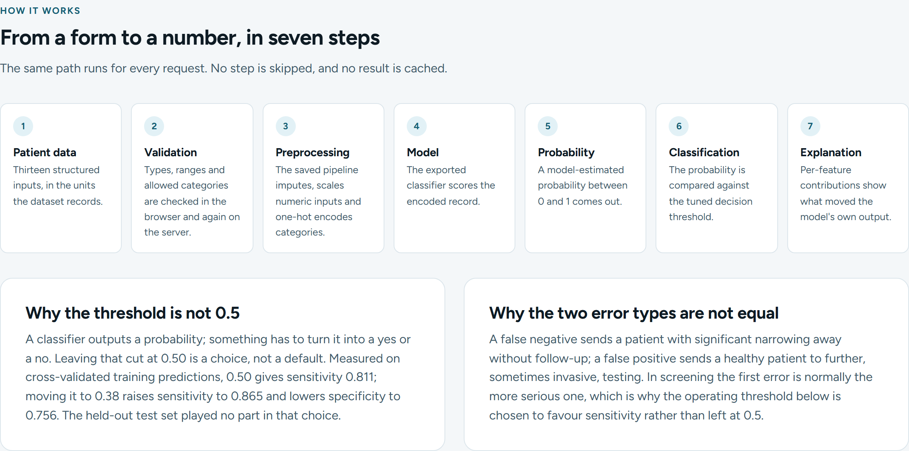
</div>

### Performance

<div align="center">

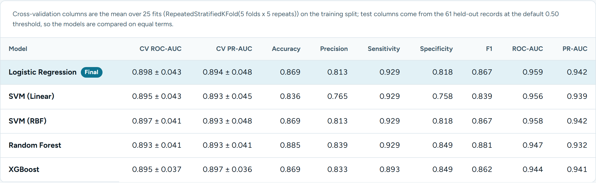

<sub>Cross-validation and held-out columns for every model, loaded from <code>models/metrics.json</code>. No metric is written into the front-end source.</sub>

<br><br>

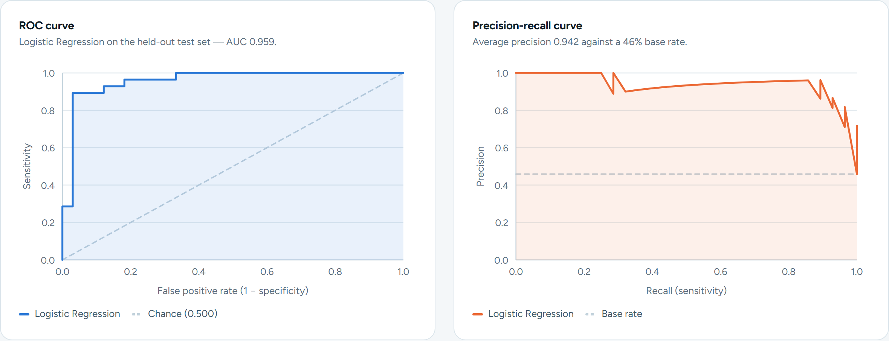

<br>

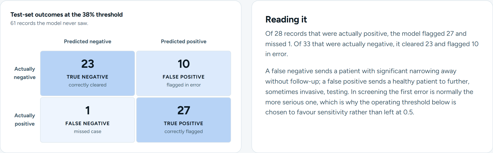

<br>

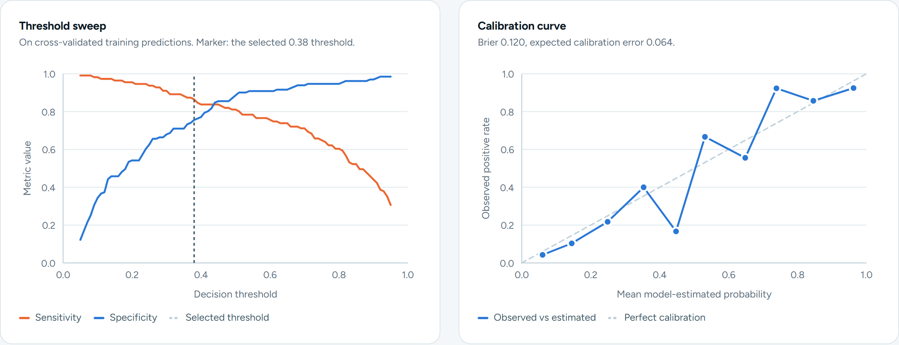

<br>

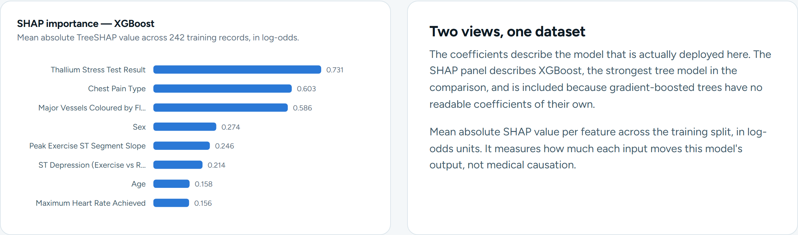

<sub><b>All charts are hand-drawn inline SVG.</b> No chart library, no UI framework — nothing that can fail to load.</sub>

</div>

### Responsive and accessible

<table>
<tr>
<td width="33%" align="center">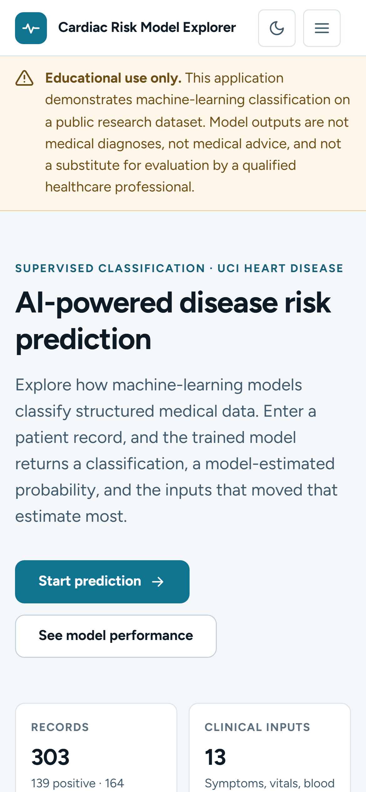<br><sub>390 px — single column, no horizontal overflow</sub></td>
<td width="33%" align="center">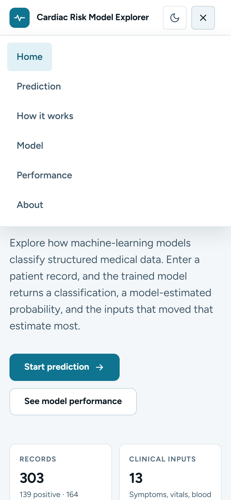<br><sub>Disclosure menu, 48 px touch targets</sub></td>
<td width="33%" align="center">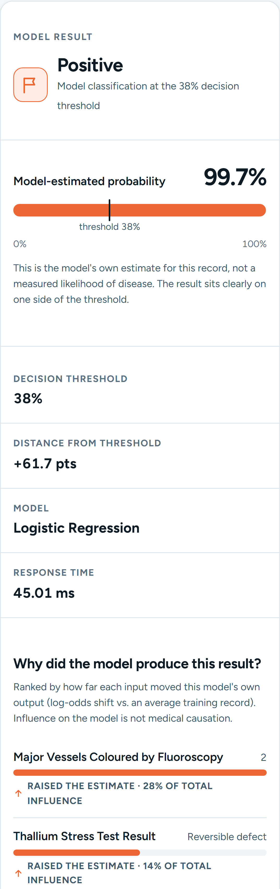<br><sub>Result card, stacked</sub></td>
</tr>
</table>

<details>
<summary><b>The design decisions behind it</b> — colour, contrast, accessibility, and which skill guidance was rejected</summary>

<br>

**Colour is never the only channel.** No red-for-sick / green-for-healthy — a classification is
not a verdict. Positive uses a calm orange with a flag icon, negative a blue with a check, and
every state also carries an icon and a text label.

**The chart palette was validated, not eyeballed.** The blue/orange pair was run through the
data-visualisation palette validator against this project's actual surfaces. All six checks pass
in both themes:

| Check | Light | Dark |
|---|:---:|:---:|
| Lightness band | pass | pass |
| Chroma floor | pass | pass |
| Colour-vision-deficiency separation (worst pair) | ΔE 9.2 | ΔE 9.4 |
| Normal-vision floor (worst pair) | ΔE 24.0 | ΔE 20.9 |
| Contrast vs surface | relief rule applied | pass |

**Contrast was computed for every token pair, and two real failures were fixed.** The muted text
token measured 4.31:1 on the secondary surface and was darkened to 5.22:1. The confusion-matrix
ramp originally put white text on a mid-blue fill at **2.50:1** — the ramp was re-stepped so a
single dark ink colour clears 4.5:1 on every cell. Text never wears a data colour: the series
hues measure ~3.2:1 on white, so influence labels use text tokens and let the coloured arrow
carry identity.

**Accessibility.** Semantic landmarks and heading order · keyboard navigable end to end · 2 px
focus ring at ≥3.4:1 on every surface, with nothing anywhere removing outlines ·
`scroll-padding-top` so focus is never hidden behind the sticky header (WCAG 2.2 *Focus Not
Obscured*) · no target under 40 px · no positive `tabindex` · every chart carries a descriptive
`role="img"` label and its numbers also appear in a real table · `prefers-reduced-motion`
honoured · SVG icons, no emoji used as iconography.

**Design skills were consulted, and one recommendation was rejected.** The `ui-ux-pro-max` skill
supplied the healthcare design system (Swiss/minimal, calm cyan, Figtree/Noto Sans) and the
focusable error-summary pattern. Its recommended landing structure — hero, *testimonials*, CTA —
was **not used**: testimonials would mean fabricating social proof for a student project. The
`dataviz` skill supplied the mark specifications (2 px lines, hairline recessive grids, ≥8 px
markers) and the rule that text never wears a data colour.

**Verified at** 375, 390, 768, 1000, 1100, 1280 and 1440 px with no horizontal overflow at any
width, in both themes, with **zero console messages of any kind** on a clean load.

</details>

---

## 📊 Dataset, and why this one

<div align="center">

**UCI Heart Disease — Cleveland subset** ·
[archive.ics.uci.edu/dataset/45](https://archive.ics.uci.edu/dataset/45/heart+disease)

</div>

| Records | Features | Classes | Missing | Duplicates |
|:---:|:---:|:---:|:---:|:---:|
| **303** | **13** → 22 encoded | 2 — 164 neg (54.1%) / 139 pos (45.9%) | 6 cells (`ca`×4, `thal`×2) | 0 |

Downloaded at run time, SHA-256 recorded in `data/raw/SOURCE.json`, cached locally.
**Label:** angiographic status — 0 = <50% narrowing in all major vessels, 1 = >50% in at least
one — derived by binarising the original `num` column (0–4).

### Three candidates were profiled before choosing

Real output from [`scripts/dataset_survey.py`](scripts/dataset_survey.py):

| Candidate | Rows × features | Minority | Missing | Feature types |
|---|:---:|:---:|---|---|
| **✅ Heart Disease (Cleveland)** | 303 × 13 | 45.9% | 6 cells, 2 columns | 8 categorical-like + 5 continuous |
| ❌ Breast Cancer Wisconsin | 569 × 30 | 37.3% | none | 30 continuous |
| ❌ Pima Indians Diabetes | 768 × 8 | 34.9% | 374 impossible zeros in `insulin` alone | 8 continuous |

Cleveland is the smallest — that is its real cost. It was still chosen because it is the **only**
candidate that:

- **covers all four feature groups the brief names** — symptoms (chest pain type,
  exercise-induced angina), age, blood tests (cholesterol, fasting blood sugar), and clinical
  measurements (blood pressure, max heart rate, ST depression, fluoroscopy, thallium scan);
- **mixes categorical and continuous inputs**, so a `ColumnTransformer` combining one-hot
  encoding with scaling is genuinely required rather than decorative;
- **carries real documented missing values**, forcing the imputation question to be answered
  properly inside the pipeline;
- **has features a person can be shown.** "Chest Pain Type" is meaningful in a form. Breast
  Cancer's *worst fractal dimension* is not.

Pima was additionally rejected for a public demonstration: a single-sex, single-heritage cohort
with 48.7% of `insulin` silently missing as zeros invites exactly the over-generalisation this
project tries to avoid.

<details>
<summary><b>Full feature dictionary</b> — all 13 inputs, their meaning and allowed values</summary>

<br>

| Interface label | Column | Type | Units | Allowed values |
|---|---|---|---|---|
| Age | `age` | numeric | years | 18–100 *(observed 29–77)* |
| Sex | `sex` | binary | – | 0 = Female, 1 = Male |
| Chest Pain Type | `cp` | nominal | – | 1 Typical angina · 2 Atypical angina · 3 Non-anginal pain · 4 Asymptomatic |
| Exercise-Induced Angina | `exang` | binary | – | 0 = No, 1 = Yes |
| Resting Blood Pressure | `trestbps` | numeric | mm Hg | 80–220 *(observed 94–200)* |
| Serum Cholesterol | `chol` | numeric | mg/dl | 100–600 *(observed 126–564)* |
| Fasting Blood Sugar > 120 mg/dl | `fbs` | binary | – | 0 = No, 1 = Yes |
| Resting ECG Result | `restecg` | nominal | – | 0 Normal · 1 ST-T abnormality · 2 LV hypertrophy |
| Maximum Heart Rate Achieved | `thalach` | numeric | bpm | 60–220 *(observed 71–202)* |
| ST Depression (Exercise vs Rest) | `oldpeak` | numeric | mm | 0–7 *(observed 0.0–6.2)* |
| Peak Exercise ST Segment Slope | `slope` | nominal | – | 1 Upsloping · 2 Flat · 3 Downsloping |
| Major Vessels Coloured by Fluoroscopy | `ca` | numeric (ordered count) | count | 0–3 |
| Thallium Stress Test Result | `thal` | nominal | – | 3 Normal · 6 Fixed defect · 7 Reversible defect |

`ca` is modelled as an ordered count rather than one-hot encoded: 0 < 1 < 2 < 3 is a real
ordering, the relationship with the outcome is monotone, and it costs three encoded columns fewer
on a 242-row training split.

</details>

<details>
<summary><b>Cleaning decisions</b> — each one logged with its reason</summary>

<br>

1. **Target binarised.** `num` encodes severity 0–4; values 1–4 all mean >50% narrowing, and each
   sub-level has fewer than 40 records. A five-class model at n = 303 would be unreliable.
2. **Missing values retained, not dropped.** 6 cells (0.14% of the frame). Dropping those rows
   would discard 2% of an already small dataset; imputing here would leak test statistics into
   training. Imputation is deferred to the pipeline, where it is fitted per fold.
3. **Duplicates: 0 found**, so none removed. The check matters — identical records split across
   train and test would inflate every metric.
4. **Out-of-codebook values: none.** Every feature was checked against its documented domain.
5. **Outliers retained.** A cholesterol of 564 mg/dl is clinically plausible and informative.
   Deleting it at n = 303 would bias the model toward the average patient; robustness is handled
   by standardisation and regularisation instead.

</details>

<details>
<summary><b>What the exploratory analysis found</b> — including one caveat worth knowing</summary>

<br>

**Correlation with the outcome:** `thal` +0.526 · `ca` +0.460 · `exang` +0.432 · `oldpeak` +0.425
· `thalach` −0.417 · `cp` +0.414 · `slope` +0.339 · `sex` +0.277 · `age` +0.223 · `restecg` +0.169
· `trestbps` +0.151 · **`chol` +0.085 · `fbs` +0.025**.

Cholesterol and fasting blood sugar are almost uncorrelated with the outcome here — a useful
counterweight to the popular intuition. They are kept: a weak marginal correlation does not
preclude a useful contribution in a multivariable model.

**Positive rate by category** (cohort base rate 45.9%): asymptomatic chest pain **72.9%** vs
typical angina 30.4% · reversible thallium defect **76.1%** vs normal 22.3% · exercise-induced
angina yes **76.8%** vs no 30.9% · male 55.3% vs female 25.8% · flat ST slope 65.0% vs upsloping
25.4%.

> [!IMPORTANT]
> **`restecg = 1` occurs in only 4 records.** Its one-hot column is fitted on almost no data and
> its coefficient should not be interpreted. Found during EDA, and stated rather than buried.

<div align="center">
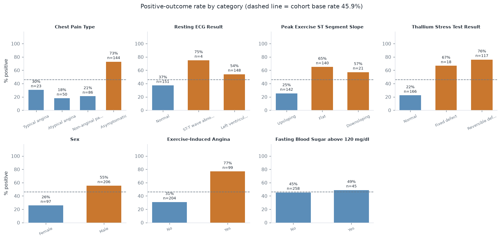
</div>

</details>

---

## 🔬 Pipeline

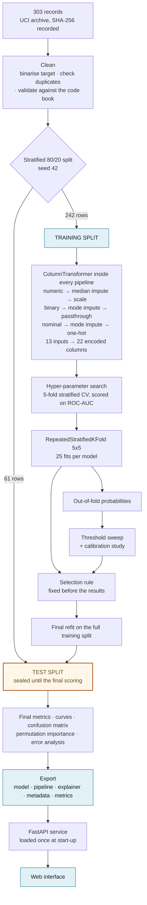

> [!TIP]
> **Preprocessing is never fitted outside a training fold**, and that claim is tested rather than
> asserted: the suite checks that the fitted scaler means equal the *training* means and
> **differ** from the full-dataset means, that `transform()` does not mutate fitted state, that a
> cloned pipeline carries no fitted preprocessing, and that re-fitting on different rows changes
> the statistics.

Scaling is applied for logistic regression and the SVMs, where feature scale changes the
solution, and skipped for the tree ensembles, which are invariant to monotone rescaling — that
keeps their split thresholds in original clinical units.

---

## 🧰 Algorithms and tuning

| Model | Search | Best CV score | Selected hyper-parameters |
|---|---|:---:|---|
| **Logistic Regression** | Grid, 24 combos | **0.9085** | `C=0.5`, `l1_ratio=0.0` (ridge), `class_weight='balanced'` |
| SVM (Linear) | Grid, 8 combos | 0.9036 | `C=0.1`, `class_weight=None` |
| SVM (RBF) | Grid, 32 combos | 0.9054 | `C=1.0`, `gamma=0.01`, `class_weight='balanced'` |
| Random Forest | Randomised, 60 of 288 | 0.8999 | `n_estimators=600`, `max_depth=None`, `min_samples_split=5`, `min_samples_leaf=4`, `max_features='sqrt'`, `class_weight='balanced'` |
| XGBoost | Randomised, 60 of 384 | 0.8997 | `n_estimators=200`, `learning_rate=0.03`, `max_depth=2`, `subsample=0.8`, `colsample_bytree=0.7`, `reg_lambda=5.0`, `min_child_weight=5`, `scale_pos_weight=1.18` |

Grids are deliberately small. On 242 training rows, the maximum of a huge grid is itself an
optimistically biased estimate; a compact, well-centred grid is the more honest instrument.

The SVMs have no native probability output, so they are wrapped in
`CalibratedClassifierCV(..., method='sigmoid', ensemble=False, cv=5)` — Platt scaling fitted on
internal folds, and the supported replacement for the deprecated `SVC(probability=True)`.

<details>
<summary><b>XGBoost early stopping</b> — where the <code>n_estimators</code> grid came from</summary>

<br>

Run separately on an inner 80/20 split of the training data (193 fit / 49 validation), 1000
rounds offered, patience 40:

| Best iteration | Best validation log-loss | Rounds offered |
|:---:|:---:|:---:|
| **98** | 0.36844 | 1000 |

That result is why the search grid offers 200–400 estimators rather than thousands. The grid
search itself uses plain cross-validation, so every candidate is scored identically.

</details>

<details>
<summary><b>Class imbalance</b> — SMOTE was measured, then deliberately not used</summary>

<br>

The training split is 1.18 : 1 (45.9% minority) — mild. The question was still measured. A
logistic-regression baseline under three strategies, 5-fold stratified CV, **SMOTE applied inside
each training fold only, never to the whole dataset**:

| Strategy | ROC-AUC | Recall | F1 |
|---|:---:|:---:|:---:|
| No resampling | 0.9069 ± 0.0177 | 0.7656 ± 0.0451 | 0.8136 ± 0.0098 |
| `class_weight='balanced'` | 0.9082 ± 0.0184 | **0.8281** ± 0.0542 | **0.8444** ± 0.0264 |
| SMOTE inside folds | 0.9086 ± 0.0177 | 0.8190 ± 0.0512 | 0.8347 ± 0.0199 |

SMOTE gains **0.0017 ROC-AUC** — a tenth of the fold-to-fold standard deviation, i.e. nothing.
Class weighting achieves a larger recall gain (+0.063) at no cost and without synthesising
patients, so it stays a tunable option in every grid; the selected model uses it. SMOTE is not
applied in the final pipeline.

</details>

---

## 📈 Results

CV columns: mean ± sd over **25 fits** (`RepeatedStratifiedKFold` 5 × 5) on the training split.
Test columns: the **61 held-out records** at the default 0.50 threshold, so every model is
compared on identical terms.

| Model | CV ROC-AUC | CV PR-AUC | Accuracy | Precision | Sensitivity | Specificity | F1 | ROC-AUC | PR-AUC |
|---|:---:|:---:|:---:|:---:|:---:|:---:|:---:|:---:|:---:|
| **🏆 Logistic Regression** | **0.898** ± 0.043 | 0.894 ± 0.048 | 0.869 | 0.812 | 0.929 | 0.818 | 0.867 | **0.959** | 0.942 |
| SVM (Linear) | 0.895 ± 0.043 | 0.893 ± 0.045 | 0.836 | 0.765 | 0.929 | 0.758 | 0.839 | 0.956 | 0.939 |
| SVM (RBF) | 0.897 ± 0.041 | 0.893 ± 0.048 | 0.869 | 0.812 | 0.929 | 0.818 | 0.867 | 0.958 | 0.942 |
| Random Forest | 0.893 ± 0.041 | 0.893 ± 0.041 | **0.885** | 0.839 | 0.929 | **0.849** | **0.881** | 0.947 | 0.932 |
| XGBoost | 0.895 ± 0.037 | **0.897** ± 0.036 | 0.869 | 0.833 | 0.893 | **0.849** | 0.862 | 0.944 | 0.941 |

<div align="center">
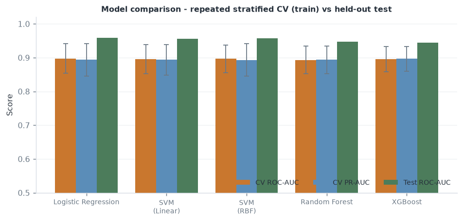
</div>

> [!IMPORTANT]
> **The most important result in this project is the flatness.** The spread across five very
> different algorithms is **0.005 CV ROC-AUC** against a fold-to-fold standard deviation of about
> **0.04**. They are statistically indistinguishable. The RBF kernel buys nothing over the linear
> one, and gradient boosting buys nothing over logistic regression.
>
> Note also that the ordering *flips* between CV and test — logistic regression has the best test
> ROC-AUC while random forest has the best test accuracy. On 61 records that reordering is noise,
> which is exactly why selection is based on cross-validation, not on the test split.

---

## 🎯 Choosing the final model

<div align="center">

### Logistic Regression

`C=0.5` · ridge penalty · `class_weight='balanced'` · **threshold 0.38** · uncalibrated

</div>

The rule was fixed **before** the numbers were in:

```
1.  Rank by mean cross-validated ROC-AUC.
    Keep every model within ONE STANDARD ERROR of the best        -> cut-off 0.8890
    At 242 training rows, differences smaller than that are not real.

2.  Apply the same one-standard-error filter to PR-AUC            -> cut-off 0.8893
    so a model clearly weaker on the positive class is dropped.

3.  Among the survivors, prefer the BETTER-CALIBRATED model,
    treating Brier differences below 0.01 as ties.

4.  Break remaining ties on INTERPRETABILITY, then the
    train/test gap, then fit cost.
```

All five models survive steps 1 and 2 — so the decision is made entirely on the tie-breakers:

| Rank | Model | CV ROC-AUC | CV PR-AUC | Brier | Calibration | Interpretability tier | Train–test gap | Fit (s) |
|:---:|---|:---:|:---:|:---:|:---:|:---:|:---:|:---:|
| **1** | **Logistic Regression** | 0.8976 | 0.8938 | **0.1203** | best | **1** | 0.0337 | 0.04 |
| 2 | SVM (Linear) | 0.8950 | 0.8935 | 0.1224 | best | 2 | 0.0294 | 0.05 |
| 3 | XGBoost | 0.8954 | 0.8966 | 0.1274 | best | 3 | 0.0552 | 0.13 |
| 4 | SVM (RBF) | 0.8968 | 0.8932 | 0.1220 | best | 4 | 0.0247 | 0.06 |
| 5 | Random Forest | 0.8934 | 0.8935 | 0.1330 | **worse** | 3 | **0.0823** | 0.72 |

Logistic regression wins on the best Brier score, the only reasoning that is directly readable as
signed coefficients and odds ratios, the smallest generalisation gap among the interpretable
models, and the lowest cost to fit and serve.

> [!NOTE]
> **Random forest is the instructive case.** It has the best raw test accuracy (0.885) and
> **would have won under an accuracy-maximising rule**. It is eliminated at step 3 for the worst
> calibration and carries the largest generalisation gap — 0.0823, about 2.4× the winner's. It
> fits the training folds harder without generalising better. That is precisely the failure mode
> "don't optimise for accuracy alone" is meant to prevent.

### Held-out performance — 61 records the model never saw

| Metric | At 0.50 | At 0.38 *(deployed)* |
|---|:---:|:---:|
| Accuracy | 0.869 | 0.820 |
| Precision | 0.813 | 0.730 |
| **Sensitivity** | 0.929 | **0.964** |
| Specificity | 0.818 | 0.697 |
| F1 | 0.867 | 0.831 |
| ROC-AUC | 0.959 | 0.959 |
| PR-AUC | 0.942 | 0.942 |
| Brier | 0.089 | 0.089 |

ROC-AUC, PR-AUC and Brier are threshold-independent, so they are identical in both columns — only
the classification decision moves.

<table>
<tr>
<td width="50%" align="center">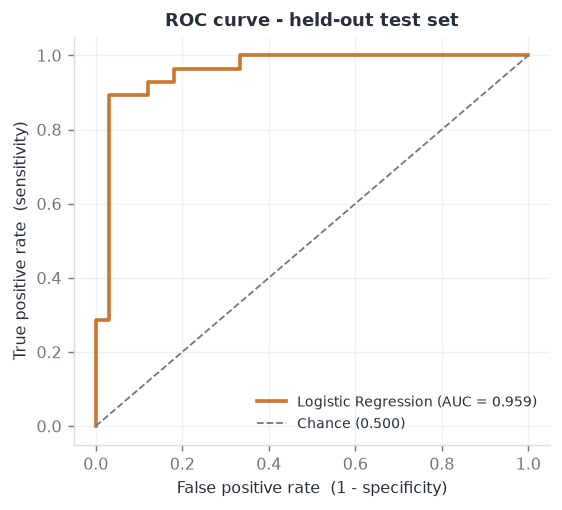</td>
<td width="50%" align="center">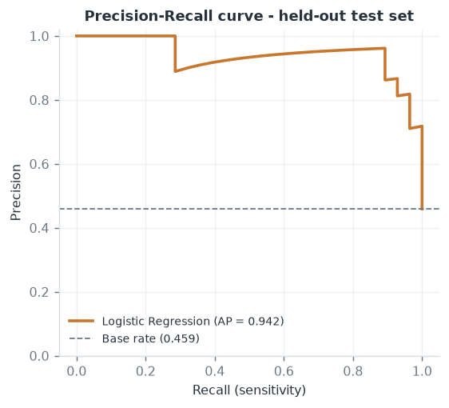</td>
</tr>
<tr>
<td align="center">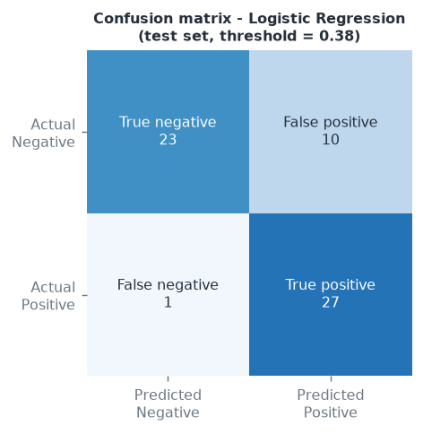</td>
<td align="center">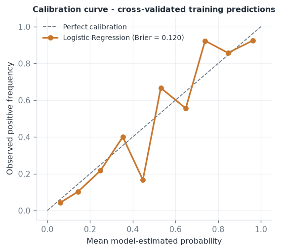</td>
</tr>
</table>

> [!WARNING]
> **Test ROC-AUC (0.959) exceeds cross-validated ROC-AUC (0.898).** That is not evidence of a
> better model — it is what a 61-record test split looks like. The CV figure, computed over 25
> fits, is the more trustworthy estimate.

---

## 📐 Threshold and calibration

0.50 is a default, not a decision. The sweep is computed on **cross-validated training
predictions**; the test set played no part in choosing it.

| Operating point | Threshold | Sensitivity | Specificity | Precision | F1 |
|---|:---:|:---:|:---:|:---:|:---:|
| Default | 0.50 | 0.811 | 0.886 | 0.857 | 0.833 |
| Maximum F1 | 0.51 | 0.802 | 0.901 | 0.873 | 0.836 |
| **✅ Selected** — highest specificity at ≥85% sensitivity | **0.38** | **0.865** | 0.756 | 0.750 | 0.803 |

Maximum F1 lands essentially at the default and would *reduce* sensitivity, because F1 weights
precision and recall equally — not the right weight for screening. The selected rule states the
clinical preference explicitly.

<div align="center">
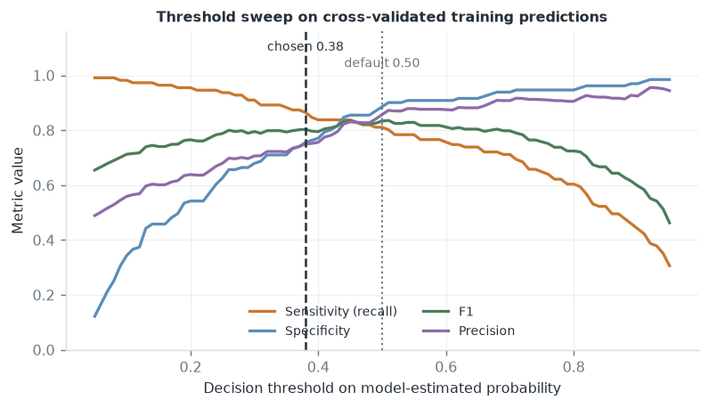
</div>

**Calibration** — measured on cross-validated training predictions:

| Variant | Brier | Expected calibration error | ROC-AUC |
|---|:---:|:---:|:---:|
| **Uncalibrated (deployed)** | **0.1203** | 0.0638 | 0.9048 |
| Platt scaling (sigmoid) | 0.1228 | 0.0637 | 0.9049 |
| Isotonic regression | 0.1213 | 0.0652 | 0.9000 |

Neither recalibration improves the Brier score — unsurprising, since logistic regression
optimises log-loss directly. Brier 0.1203 against a no-skill baseline of 0.248 means the
estimates carry real information, which is what licenses the phrase **"model-estimated
probability"** in the interface.

---

## 🔍 Explainability

Three global views and one local view. All of them describe **influence on the model's own
output** — none is evidence that a feature *causes* disease.

<table>
<tr>
<td width="50%" valign="top">

**Permutation importance**
*Drop in test ROC-AUC when one column is shuffled, 30 repeats*

| Feature | Drop | sd |
|---|:---:|:---:|
| Major Vessels (fluoroscopy) | **0.0886** | 0.0339 |
| Chest Pain Type | 0.0308 | 0.0111 |
| Thallium Stress Test | 0.0139 | 0.0092 |
| Peak Exercise ST Slope | 0.0126 | 0.0083 |
| ST Depression | 0.0103 | 0.0043 |

</td>
<td width="50%" valign="top">

**Coefficients of the deployed model**
*Log-odds; numeric inputs standardised, so comparable*

| Encoded feature | Coef. | Odds ratio |
|---|:---:|:---:|
| Major Vessels (fluoroscopy) | +1.028 | 2.795 |
| Sex (male) | +0.984 | 2.676 |
| Thallium: Normal | −0.778 | 0.459 |
| Chest Pain: Asymptomatic | +0.757 | 2.131 |
| Thallium: Reversible defect | +0.606 | 1.833 |

</td>
</tr>
</table>

**TreeSHAP** — exact, on the strongest tree model (XGBoost), mean |SHAP| across the 242 training
records in log-odds. Included because gradient-boosted trees have no readable coefficients of
their own: Thallium **0.731** · Chest Pain Type **0.603** · Major Vessels **0.586** · Sex 0.274 ·
ST Slope 0.246.

The three methods disagree on exact ordering — permutation puts `ca` first, SHAP puts `thal`
first — which is itself informative: they measure different things (loss degradation on held-out
data vs average attribution across training records), and the top three are the same set either
way.

<table>
<tr>
<td width="50%" align="center">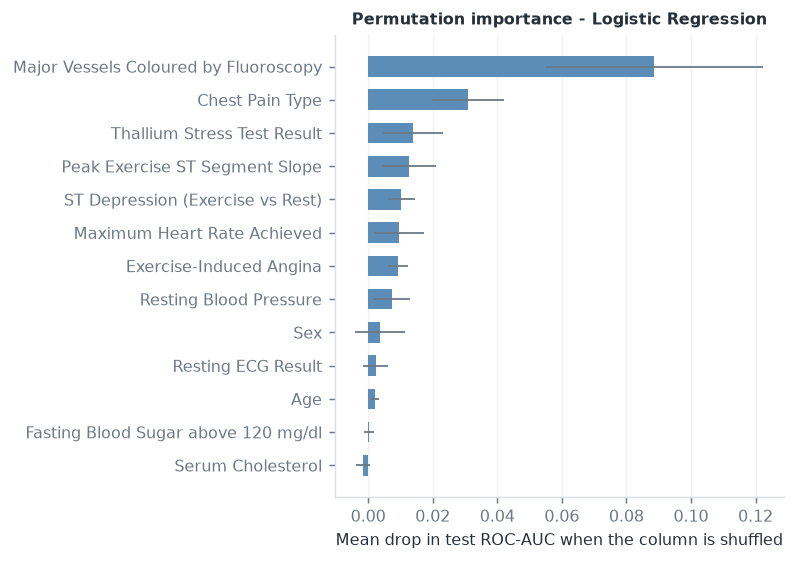</td>
<td width="50%" align="center">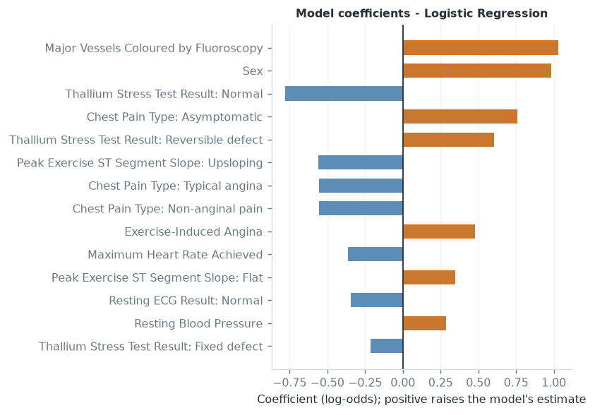</td>
</tr>
</table>

<details>
<summary><b>Per-prediction attribution</b> — three strategies, chosen automatically</summary>

<br>

The explainer is exported alongside the model and returned by the API on every prediction:

| Deployed estimator | Method | What it computes |
|---|---|---|
| Linear *(current)* | `linear_coefficients` | `w_j × (x_j − mean_j)` on the encoded matrix, summed back onto the 13 raw features. Additive in log-odds and **exact**. |
| Tree | `tree_shap` | Exact TreeSHAP values. |
| Anything else *(e.g. the SVMs behind their probability layer)* | `ablation` | Model-agnostic: replace one input with its training reference value and measure how far the estimate moves. 13 extra forward passes. |

> The interface says **"raised the estimate"** and **"lowered the estimate"**, never "causes
> disease". A test enforces that the explanation wording contains no causal or diagnostic
> language.

</details>

---

## 🧪 Error analysis

At the deployed 0.38 threshold on 61 held-out records:

<div align="center">

| | Predicted negative | Predicted positive |
|---|:---:|:---:|
| **Actually negative** | **23** true negative | **10** false positive |
| **Actually positive** | **1** false negative | **27** true positive |

</div>

**Patterns found:**

1. **The model knows when it is unsure.** Mean distance from the threshold is **0.199 for wrong
   predictions versus 0.401 for correct ones** — errors cluster near the decision boundary, which
   is the behaviour a well-calibrated score should show.
2. **The single false negative** — age 60, 0 vessels coloured, ST depression 3.00 mm (test-set
   averages 54.0, 0.93, 1.20). A normal fluoroscopy result, the feature the model leans on
   hardest; the elevated ST depression was not enough to overcome it. Estimated probability
   29.2%, so it was not a confident miss.
3. **The 10 false positives** average 0.89 vessels coloured and 0.69 mm ST depression — close to
   the cohort average on both. Genuinely ambiguous records, not a systematic failure mode.
4. **The threshold explains the shape of the errors.** At 0.50 the same model gives
   27 TN / 6 FP / 2 FN / 26 TP. Moving to 0.38 converts one false negative into four extra false
   positives — the intended direction of the trade.

> [!NOTE]
> **Why both error types matter.** A false negative sends a patient with significant arterial
> narrowing away without follow-up. A false positive sends a healthy patient to further testing
> that is costly, anxiety-inducing and sometimes invasive. Neither is free. In screening the
> first is normally judged more serious — but at 0.38 this model would send **30% of healthy
> patients** for unnecessary follow-up, and that cost is stated rather than glossed over.

---

## 🏗 Architecture

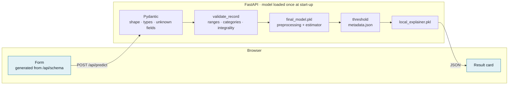

The **Model** and **Performance** sections render from `GET /api/model` and `GET /api/metrics`,
which read `models/metadata.json` and `models/metrics.json`. **No metric is written into the
front-end source.** Delete the artefacts and the interface shows an "artefacts unavailable" state
with recovery instructions — a behaviour that is itself tested.

<details>
<summary><b>Project structure</b></summary>

<br>

```
Disease-Prediction/
├── app/
│   ├── main.py                     FastAPI service · model loaded once at start-up
│   ├── schemas.py                  Pydantic request schema
│   └── static/
│       ├── index.html              Semantic single-page structure
│       ├── styles.css              Design system: tokens, components, responsive rules
│       └── app.js                  Form generation, validation, SVG charts, rendering
├── data/
│   ├── raw/                        Cached UCI download + SOURCE.json (sha256)
│   └── processed/                  heart_clean.csv
├── models/
│   ├── final_model.pkl             Full sklearn Pipeline (preprocessing + estimator)
│   ├── preprocessing_pipeline.pkl
│   ├── local_explainer.pkl         Per-prediction attribution
│   ├── metadata.json               Model card, split, seed, threshold, environment, timings
│   ├── metrics.json                Every metric, curve, sweep and study from the run
│   └── feature_info.json           Feature schema + dictionary
├── notebooks/
│   └── disease_prediction.ipynb    Executed walk-through · 23 code cells · 0 errors
├── outputs/
│   ├── figures/                    14 analysis figures + 19 UI screenshots in ui/
│   ├── metrics/                    Per-phase JSON exports
│   └── predictions/                test_predictions.csv with per-record outcomes
├── scripts/
│   ├── dataset_survey.py           Phase-1 evidence for the dataset choice
│   ├── build_notebook.py           Generates and executes the notebook
│   └── capture_ui.py               Drives a real browser to photograph the running app
├── src/
│   ├── config.py                   Paths, seed, feature schema — single source of truth
│   ├── data_loader.py              Download, profile, clean
│   ├── preprocessing.py            Leakage-safe ColumnTransformer
│   ├── eda.py                      Exploratory figures + findings
│   ├── models.py                   Model zoo and search grids
│   ├── evaluate.py                 Metrics, threshold search, calibration
│   ├── explainability.py           Global and local explanations
│   ├── plots.py                    Evaluation figures
│   ├── train.py                    End-to-end training run
│   ├── inference.py                Validation → preprocessing → model → explanation
│   └── utils.py                    JSON-safe serialisation, timing
├── tests/                          84 tests across 5 files
├── requirements.txt
├── README.md
└── report.md                       26-section formal report
```

</details>

---

## 🚀 Install and run

<details open>
<summary><b>1. Install</b> — Python 3.11+ (built and verified on 3.14.7)</summary>

<br>

```bash
python -m venv .venv
```

```bash
.venv\Scripts\activate
```

```bash
python -m pip install -r requirements.txt
```

<sub>On macOS/Linux the activation line is <code>source .venv/bin/activate</code>.</sub>

</details>

<details open>
<summary><b>2. Train</b> — downloads the dataset, runs every phase, writes <code>models/</code> and <code>outputs/</code> (~4–5 min)</summary>

<br>

```bash
python -m src.train
```

</details>

<details open>
<summary><b>3. Serve</b> — the application at <code>http://localhost:8000</code></summary>

<br>

```bash
python -m uvicorn app.main:app --port 8000
```

</details>

<details>
<summary><b>Optional</b> — tests, notebook, dataset survey, screenshots</summary>

<br>

Run the test suite:

```bash
python -m pytest tests -q
```

Rebuild the executed notebook:

```bash
python scripts/build_notebook.py
```

Re-run the dataset selection survey:

```bash
python scripts/dataset_survey.py
```

Re-capture the UI screenshots (needs `python -m pip install playwright` and `python -m playwright install chromium`):

```bash
python scripts/capture_ui.py
```

</details>

---

## 🔌 API

Interactive documentation is served at `/docs` once the app is running.

| Method | Endpoint | Purpose |
|:---:|---|---|
| `GET` | `/api/health` | Whether the model artefacts loaded |
| `GET` | `/api/schema` | Feature schema that generates the form |
| `GET` | `/api/model` | Model card, metadata, selection rule |
| `GET` | `/api/metrics` | Every metric, curve and study the Performance page renders |
| `POST` | `/api/predict` | Classify one record |
| `GET` | `/api/example` | A real record from the held-out test split |

### Example prediction

```bash
curl -s -X POST http://localhost:8000/api/predict -H "Content-Type: application/json" -d "{\"age\":62,\"sex\":0,\"cp\":4,\"trestbps\":140,\"chol\":268,\"fbs\":0,\"restecg\":2,\"thalach\":160,\"exang\":0,\"oldpeak\":3.6,\"slope\":3,\"ca\":2,\"thal\":3}"
```

Response — abridged, and produced by the exported model:

```json
{
  "classification": "Positive",
  "predicted_label": 1,
  "probability": 0.8184,
  "probability_percent": 81.8,
  "threshold": 0.38,
  "margin_from_threshold": 0.4384,
  "confidence_band": "clearly on one side of the threshold",
  "explanation": {
    "method": "linear_coefficients",
    "units": "log-odds shift vs. an average training record",
    "items": [
      { "label": "Major Vessels Coloured by Fluoroscopy", "display_value": "2",
        "contribution": 1.62521, "direction": "increases", "share": 0.3399 },
      { "label": "Sex", "display_value": "Female",
        "contribution": -0.671, "direction": "decreases", "share": 0.1403 },
      { "label": "Chest Pain Type", "display_value": "Asymptomatic",
        "contribution": 0.58665, "direction": "increases", "share": 0.1227 }
    ]
  },
  "model": { "name": "Logistic Regression", "threshold": 0.38, "test_roc_auc": 0.9589 },
  "disclaimer": "Educational use only. ..."
}
```

Add an optional `"threshold": 0.5` to score the same record at a different operating point.

Validation failures return **HTTP 400** with a message per field, and never a traceback:

```json
{
  "error": "invalid_request",
  "message": "Some fields need attention before the model can run.",
  "fields": { "cp": "Chest Pain Type must be one of: 1 (Typical angina), ..." }
}
```

---

## ✅ Testing

<div align="center">

**84 passed** · `python -m pytest tests -q`

</div>

| File | Tests | What it actually checks |
|---|:---:|---|
| `test_data.py` | 12 | Download, shape, exact class counts, duplicates, missing values match the UCI code book, every value inside its documented domain, cleaning-log completeness, profile accuracy, schema partitioning, human-readable labels |
| `test_preprocessing.py` | 8 | Design-matrix shape, no surviving NaNs, **scaler fitted on train rows only and provably ≠ full-dataset statistics**, `transform` does not refit, pipeline re-fits per fold, unseen-category handling, tree variant skips scaling |
| `test_models_and_metrics.py` | 25 | All four families present and importable, each trains and yields valid probabilities, each beats chance under CV, grid sizes bounded, scaling requested where it matters, metrics against a **hand-computed confusion matrix**, monotonicity of the threshold sweep, sensitivity floor respected, calibration and curve exports |
| `test_inference.py` | 22 | Every validation rule, artefact existence, reload determinism, metadata/model agreement, confusion-matrix totals, singleton loading, threshold override, ranked explanations, **non-causal wording** |
| `test_api.py` | 17 | Health, index, static assets, all four GET endpoints, happy-path prediction, consistency, six rejection cases, threshold override, **no traceback in any error body**, example-record round-trip |

**Browser testing against the live app:** form renders (13 fields, 5 fieldsets) · empty submit
produces 13 linked errors with focus moved to the summary · valid submit returns a real result ·
reset clears everything · out-of-range values blocked with `aria-invalid` and field marking ·
server-down shows a plain actionable message on every surface · **zero console messages on a
clean tab** · light and dark · 375 → 1440 px.

> [!TIP]
> **Reproducibility is proven, not claimed.** The full pipeline was executed twice and every
> exported value was **bit-identical** between runs apart from wall-clock timings.

---

## 🚧 Limitations

Stated plainly, because a model this small deserves it:

- **303 records from one hospital in 1988.** Small, old, and unrepresentative of contemporary or
  non-US populations.
- **~68% male cohort**, so performance on female patients rests on far fewer records — and `sex`
  is the second-largest coefficient in the model. The female positive rate in the data (25.8% vs
  55.3%) partly reflects the referral patterns of a 1988 cardiology clinic, not biology.
- **The label is angiographic narrowing above 50%**, not a clinical diagnosis and not an outcome
  such as a cardiac event.
- **61 test records** means every test metric carries a wide confidence interval. Differences of
  a few points between models are noise, and this project treats them as such.
- **Five models are statistically tied.** The selected one is not demonstrably the most
  accurate — it is the one a pre-declared rule picks among equals.
- **Tuning is not nested inside the evaluation**, so the repeated-CV figures are mildly
  optimistic. The held-out split is the unbiased estimate.
- **Several inputs require a hospital exercise test, fluoroscopy or a thallium scan.** This is
  not, and cannot be, a self-assessment tool.
- **`restecg = 1` occurs in 4 records**, so its encoded column is fitted on almost nothing.
- **No external validation cohort.** The Hungarian, Switzerland and Long Beach subsets were
  deliberately not merged in — they have far more missing data and different protocols.

---

## 🏥 Medical disclaimer

> **Educational use only.**
>
> This application demonstrates machine-learning classification on a public dataset. Model
> predictions are **not medical diagnoses, medical advice, or a substitute for evaluation by a
> qualified healthcare professional.** Do not use it to make, delay or avoid any health decision.
> If you have symptoms or concerns about your heart, contact a clinician or your local emergency
> service.
>
> The interface uses the phrase **"model-estimated probability"** throughout, and never
> "probability of disease".

---

## 🔭 Future work

| | |
|---|---|
| **External validation** | Test on the Hungarian, Switzerland and Long Beach VA subsets in the same archive — the strongest available check of whether this generalises beyond Cleveland. |
| **Bootstrap confidence intervals** | On every test metric, so the width of the uncertainty is visible rather than implied. |
| **Nested cross-validation** | Put tuning inside the evaluation loop, removing the optimism noted in the limitations. |
| **Subgroup reporting** | By sex and age band, with sample sizes shown, making the fairness question measurable rather than rhetorical. |
| **Interactive threshold** | Let the interface move the operating point and watch sensitivity and specificity trade off live — the API already accepts a threshold override. |
| **Decision-curve analysis** | Turn the threshold choice into an explicit statement about the cost ratio a user is willing to accept. |
| **Ops** | Prediction logging with a model version tag; containerisation with a checksum-pinned dataset in CI so a silent upstream change is caught. |

---

<div align="center">

**📄 [Full 26-section project report →](report.md)**  ·  **📓 [Executed notebook →](notebooks/disease_prediction.ipynb)**

<br>

<sub>
Dataset: <a href="https://archive.ics.uci.edu/dataset/45/heart+disease">UCI ML Repository, dataset 45</a> ·
Seed 42 · Stratified 80/20 split (242 / 61) · <code>RepeatedStratifiedKFold(5 × 5)</code><br>
Python 3.14.7 · scikit-learn 1.9.0 · XGBoost 3.4.1 · SHAP 0.52.0 · NumPy 2.5.2 · pandas 3.0.5<br>
Reproduce everything with <code>python -m src.train</code>.
</sub>

<br>

**Built as a university assignment. Educational use only — not a medical device.**

</div>
